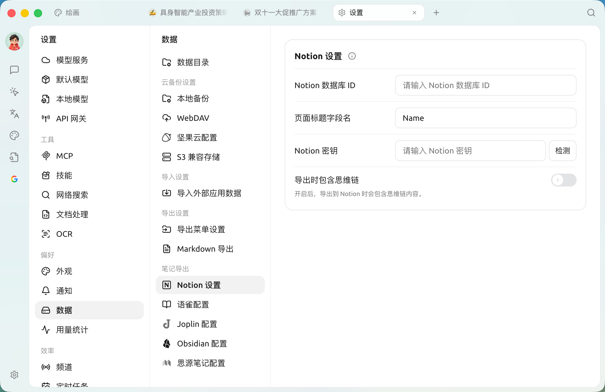
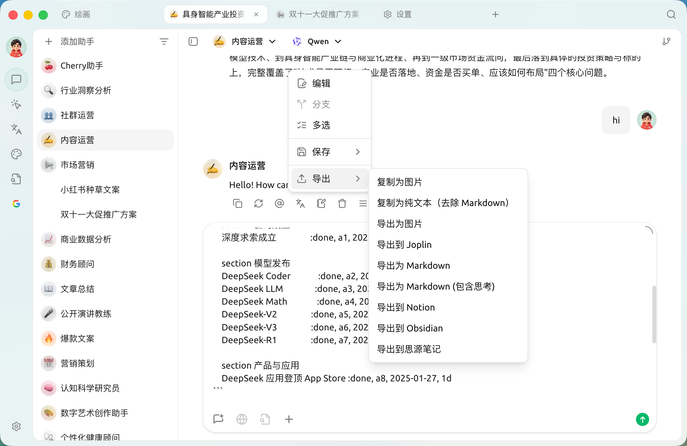

# Notion 配置教程

Cherry Studio 支持将话题导入 Notion 的数据库。

## 第一步

打开网站 [Notion Integrations](https://www.notion.so/profile/integrations) 创建一个应用

<figure><figcaption>
点击加号创建应用
</figcaption></figure>

## 第二步

创建一个应用

<figure><figcaption>
填写应用信息
</figcaption></figure>

名字：Cherry Studio

类型：选第一个

图标：可以保存一下这个图片

<figure><figcaption></figcaption></figure>

## 第三步

复制密钥填写到 Cherry Studio 设置里

<figure><figcaption>
点击复制密钥
</figcaption></figure>

<figure><figcaption>
【设置】→【数据】→【Notion 设置】：密钥 / 数据库 ID / 页面标题字段名都在这一页填写
</figcaption></figure>

## 第四步

打开 [Notion](https://www.notion.so/) 网站创建一个新页面，在下方选择数据库类型，名称填写 Cherry Studio， 按图示操作连接

<figure><figcaption>
创建一个新页面选择数据库类型
</figcaption></figure>

<figure><figcaption>
输入页面的名字，并选择连接到 APP
</figcaption></figure>

## 第五步

<figure><figcaption>
复制数据库 ID
</figcaption></figure>

如果你的 Notion 数据库的 URL 类似这样：

https://www.notion.so/\<long\_hash\_1>?v=\<long\_hash\_2>

那么 Notion 数据库 ID 就是 `<long_hash_1>` 这部分，回到上面的 Notion 设置页填入并点击检查。

## 第六步

填写 `页面标题字段名`：

若你的网页端是英文的，则填写 `Name`\
若你的网页端是中文的，则填写 `名称`

## 第七步

恭喜你，Notion 的配置已经完成了 ✅ 接下来就可以将 Cherry Studio 内容导出到你的 Notion 数据库了

<figure><figcaption>
导出到 Notion
</figcaption></figure>

<figure><figcaption>
查看导出结果
</figcaption></figure>

***

### 获取帮助与提交反馈

如果您在配置或使用过程中遇到任何疑问、Bug 或有功能改进建议，请参考 [反馈与建议](../../question-contact/suggestions.md) 中提供的官方渠道。
