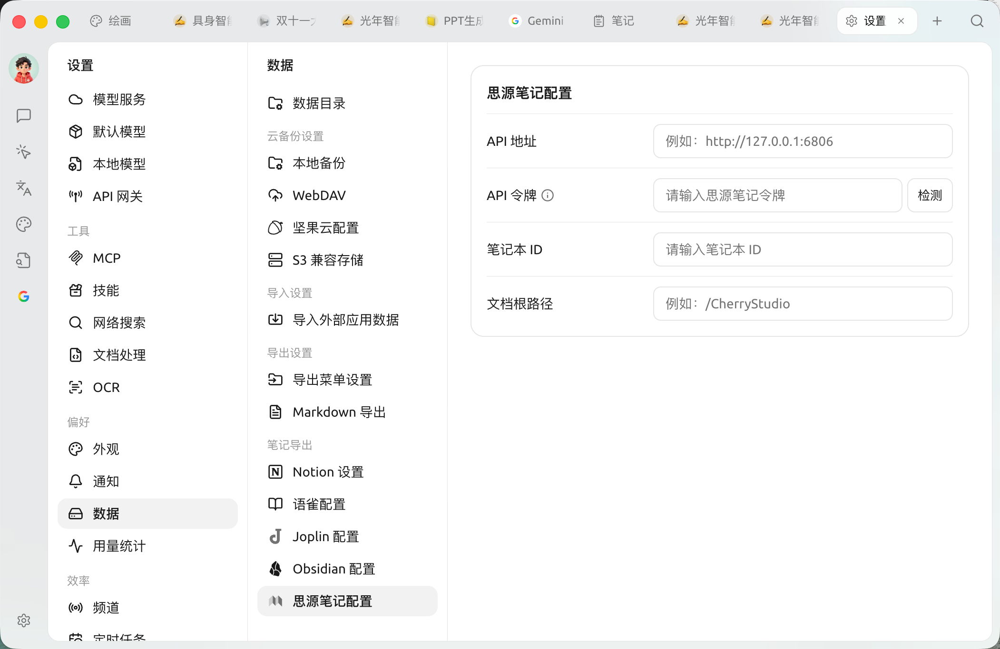
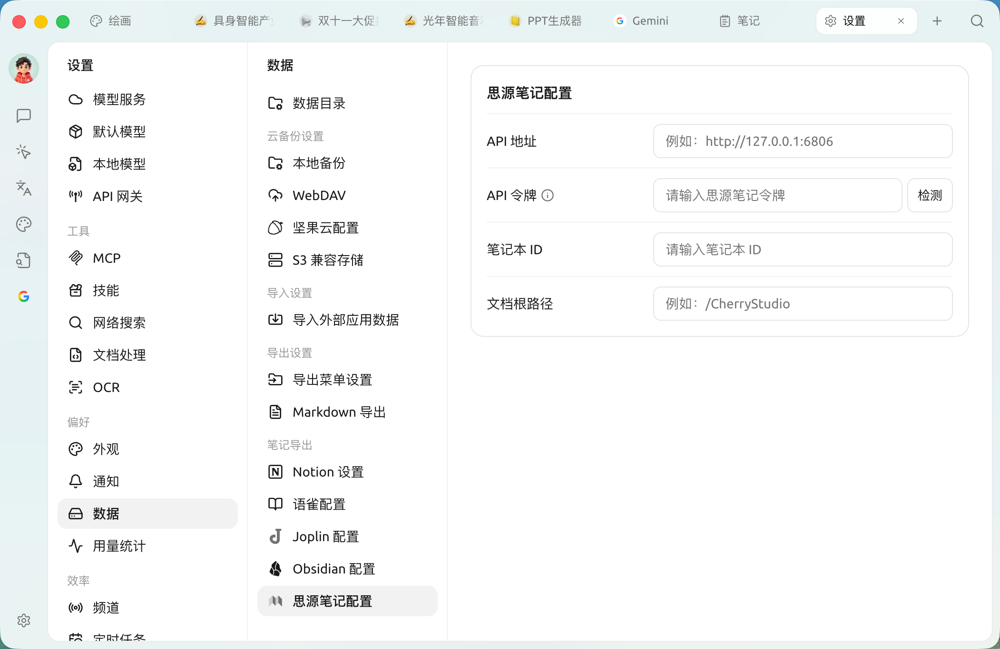

# 思源笔记配置教程

支持将话题、消息导出到思源笔记。

## 第一步

打开思源笔记，创建一个笔记本

<figure><figcaption>
点击新建笔记本
</figcaption></figure>

## 第二步

打开笔记本打开设置，并复制 `笔记本ID`

<figure><figcaption>
打开笔记本设置
</figcaption></figure>

<figure><figcaption>
点击复制笔记本 ID 按钮
</figcaption></figure>

## 第三步

复制笔记本 ID 填写到 Cherry Studio 设置里

<figure><figcaption>
将笔记本 ID 填写到数据设置里
</figcaption></figure>

## 第四步

填写思源笔记地址

* **本地**\
  通常为 `http://127.0.0.1:6806`
* **自部署**\
  为你的域名 `http://note.domain.com`

<figure><figcaption>
填入你的思源笔记地址
</figcaption></figure>

## 第五步

复制思源笔记 `API Token`

<figure><figcaption>
复制思源笔记令牌
</figcaption></figure>

填入 Cherry Studio 设置里并点击检查（配置项都在上面第四步那一页）。

## 第六步

恭喜你，思源笔记的配置已经完成了 ✅ 接下来就可以将 Cherry Studio 内容导出到你的思源笔记中了

<figure><figcaption>
查看导出结果
</figcaption></figure>

***

### 获取帮助与提交反馈

如果您在配置或使用过程中遇到任何疑问、Bug 或有功能改进建议，请参考 [反馈与建议](../../question-contact/suggestions.md) 中提供的官方渠道。
