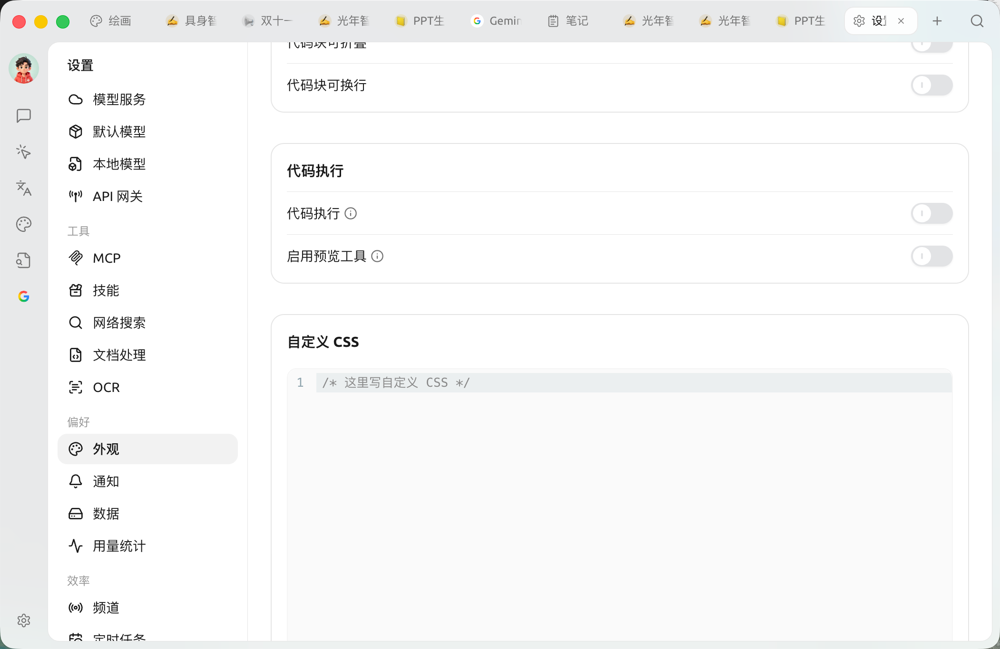

# 自定义 CSS

通过自定义 CSS，你可以在不改动源代码的情况下调整软件外观，让界面更符合自己的喜好，例如换字体、改主题色、调整消息气泡背景等。

### 在哪里设置

打开 **【设置】→【外观】**，在页面底部找到 **「自定义 CSS」** 代码框，把样式写进去即可实时生效。留空则不加载任何自定义样式。

<figure><figcaption><p>【设置】→【外观】页面底部的「自定义 CSS」代码框</p></figcaption></figure>

你写入的 CSS 会被原样注入到每个窗口的 `<head>` 中，对应一个 `<style id="user-defined-custom-css">` 元素。由于它不属于软件内部的样式分层（cascade layer），在同等选择器下你的样式优先级高于软件自带样式，因此大多数普通声明无需 `!important` 也能覆盖生效。

### 一个可用的示例

下面这段只使用软件当前真实存在的变量和选择器：

```css
/* 1. 全局字体 */
body {
  font-family: "汉仪唐美人", sans-serif;
}

/* 2. 主题色与用户消息气泡背景（浅色主题 / 默认） */
:root {
  --primary: #1a8f5a;
  --chat-user: rgba(26, 143, 90, 0.08);
}

/* 3. 深色主题下单独覆盖(切到深色主题时根元素带 .dark 类) */
.dark {
  --primary: #28b561;
  --chat-user: rgba(40, 181, 97, 0.12);
}

/* 4. 直接给主内容区换背景色 */
#content-container {
  background-color: #f6f4ec;
}
```

### 关于主题变量

软件使用一套 CSS 自定义属性(变量)来描述配色。浅色主题的默认值定义在 `:root` 上，深色主题的覆盖值定义在 `.dark` 上——切换到深色主题时，根元素会被加上 `.dark` 类。因此要区分浅色/深色，请分别写在 `:root` 和 `.dark` 选择器下，而不是使用旧的 `theme-mode` 属性选择器。

常用的公开变量包括：

| 变量 | 含义 |
| --- | --- |
| `--background` / `--foreground` | 主背景色 / 主前景(文字)色 |
| `--primary` / `--primary-foreground` | 主题色 / 主题色上的文字色 |
| `--card` / `--popover` | 卡片、浮层背景色 |
| `--muted` / `--muted-foreground` | 弱化背景 / 弱化文字色 |
| `--border` / `--input` / `--ring` | 边框、输入框、聚焦描边色 |
| `--sidebar` 系列 | 侧边栏相关配色 |
| `--chat-user` | 用户消息气泡背景色 |
| `--link` | 链接颜色 |
| `--code-block` / `--inline-code` | 代码块 / 行内代码背景色 |
| `--font-family` / `--code-font-family` | 全局字体 / 代码字体 |
| `--radius` | 圆角基准值 |

完整的变量列表和默认值请参考源代码：

- 界面样式与容器：[https://github.com/CherryHQ/cherry-studio/tree/main/src/renderer/assets/styles](https://github.com/CherryHQ/cherry-studio/tree/main/src/renderer/assets/styles)
- 主题设计令牌(设计变量)：[https://github.com/CherryHQ/cherry-studio/tree/main/packages/ui/src/styles](https://github.com/CherryHQ/cherry-studio/tree/main/packages/ui/src/styles)

### 粘贴旧样式表时的提示

如果你粘贴的是为旧版本编写、与当前界面不兼容的样式表，软件可能会将其自动禁用，并在自定义 CSS 区域给出提示。此时请先按当前的变量与选择器把样式适配好，再按提示删除首行标记以重新启用。

### 相关推荐

Cherry Studio 主题库: [https://github.com/boilcy/cherrycss](https://github.com/boilcy/cherrycss)

分享一些中国风 Cherry Studio 主题皮肤: [https://linux.do/t/topic/325119/129](https://linux.do/t/topic/325119/129)

***

### 💡 获取帮助与提交反馈

如果您在配置或使用过程中遇到任何疑问、Bug 或有功能改进建议，请参考 [反馈与建议](../../question-contact/suggestions.md) 中提供的官方渠道。
