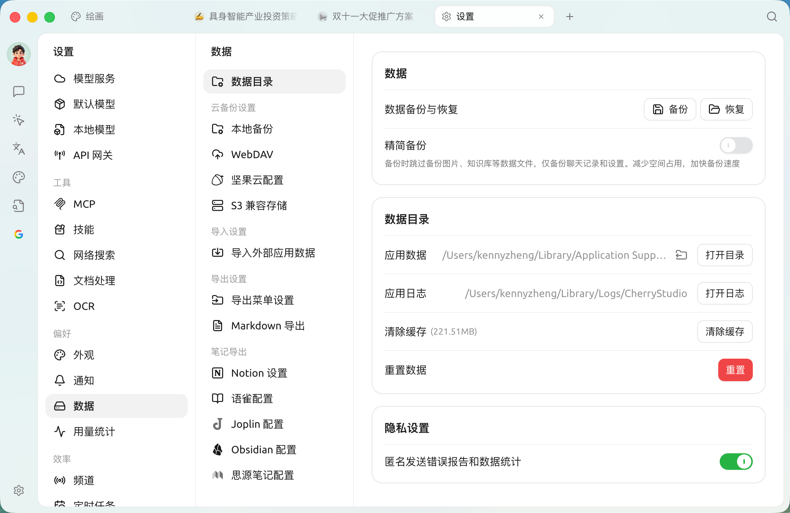

## 默认存储在哪？

Cherry Studio 按系统规范把数据放在用户目录下：

* **macOS**：`~/Library/Application Support/CherryStudio`
* **Windows**：`%APPDATA%\CherryStudio`（也就是 `C:\Users\<你的用户名>\AppData\Roaming\CherryStudio`）
* **Linux**：`~/.config/CherryStudio`

也可以在以下位置查看：

<figure><figcaption></figcaption></figure>

## 修改存储位置

如果你的 C 盘 / 系统盘空间紧张，或者你想把 Cherry Studio 的数据 **统一放到一块加密磁盘 / 外置硬盘**，可以改默认存储位置。

> 注意：换位置会 **搬走所有对话历史、助手、知识库** 等数据；操作前 **强烈建议先备份**（[WebDAV](../data-settings/webdav.md) / [S3](../data-settings/s3-compatible.md) 都行）。

* **更改路径**：【设置】→【数据】→【数据目录】→【应用数据】的迁移按钮

***

### 💡 获取帮助与提交反馈

如果您在配置或使用过程中遇到任何疑问、Bug 或有功能改进建议，请参考 [反馈与建议](../../question-contact/suggestions.md) 中提供的官方渠道。
