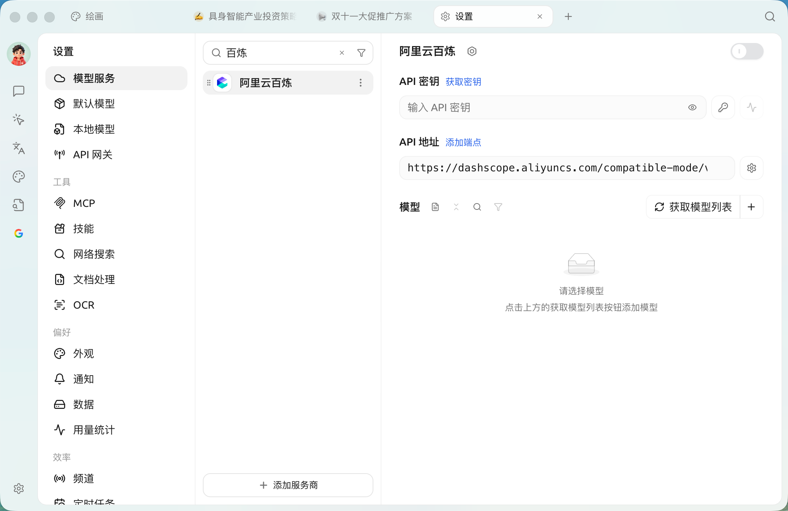

# 阿里云百炼

1. 登录 [阿里云百炼](https://bailian.console.aliyun.com/?tab=model#/api-key)，没有阿里云账号的话需要注册。
2. 点击右上角的 `创建我的 API-KEY` 按钮。

<figure><figcaption>
阿里云百炼创建 API 密钥
</figcaption></figure>

3. 在弹出的窗口中选择默认业务空间（或者你也可以自定义），如果你想要的话可以填入描述。

<figure><figcaption>
阿里云百炼创建 API 密钥弹窗
</figcaption></figure>

4. 点击右下角的 `确定` 按钮。
5. 随后，你应该能看到列表中新增了一行，点击右侧的 `查看` 按钮。

    <figure><figcaption>
阿里云百炼查看 API 密钥
</figcaption></figure>
6. 点击 `复制` 按钮。

    <figure><figcaption>
阿里云百炼复制 API 密钥
</figcaption></figure>
7. 转到 Cherry Studio，在 `设置` → `模型服务` → `阿里云百炼` 中找到 `API 密钥` ，将复制的 API 密钥粘贴到这里。

    <figure><figcaption>
阿里云百炼填入 API 密钥
</figcaption></figure>
8. 可以按照 [模型服务](../settings/providers.md) 中的介绍调整相关设置，然后就能使用了。

## 原生联网与网址读取

阿里云百炼中支持联网能力的模型可以使用原生网络搜索，部分 Qwen 模型还支持 URL 内容读取。选择模型时以名称旁的 🌐 图标为准，具体能力可能随百炼模型更新。

在对话中打开 🌐 后，如果【设置】→【网络搜索】里的【优先使用模型内置的联网工具】保持关闭（默认），Cherry Studio 会优先使用已配置的搜索服务；开启该选项后，才会优先使用模型原生能力。详见 联网模式。


如果发现模型列表中没有阿里云百炼的模型，请确认已经按照 [模型服务](../settings/providers.md) 中的介绍添加模型，并开启了这个提供商。


***

### 获取帮助与提交反馈

如果您在配置或使用过程中遇到任何疑问、Bug 或有功能改进建议，请参考 [反馈与建议](../../question-contact/suggestions.md) 中提供的官方渠道。
