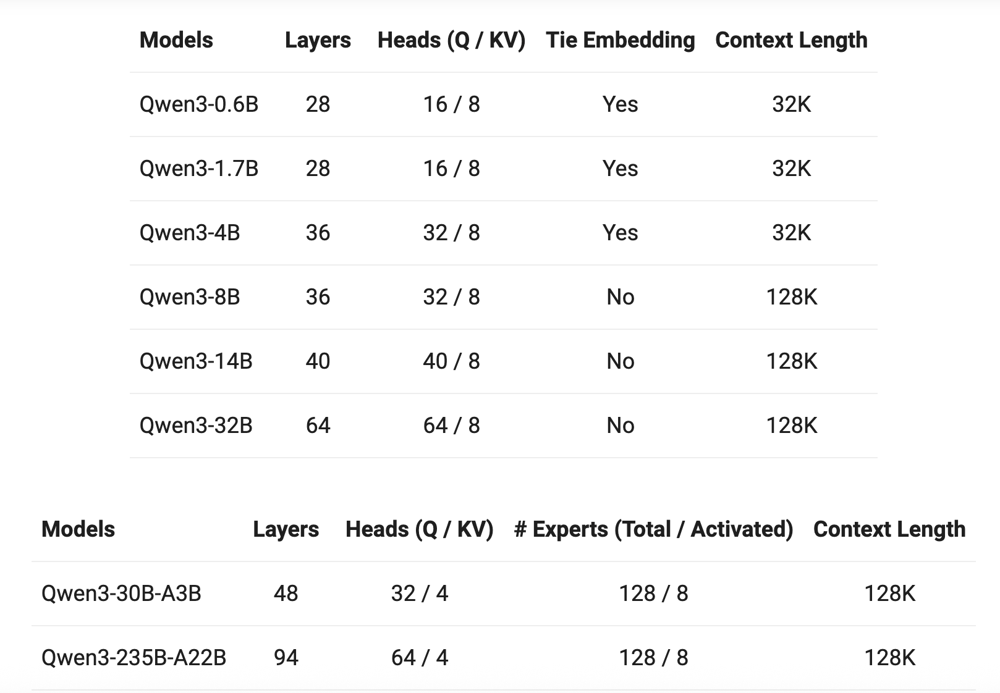
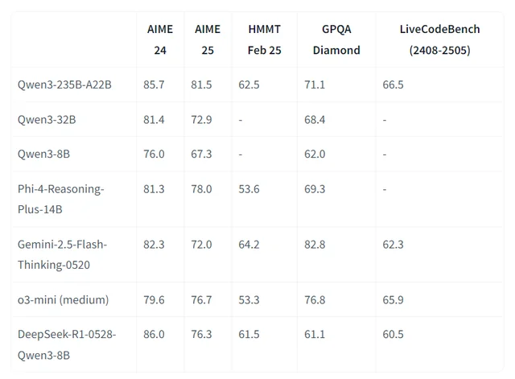

# Qwen3-8B

**知名 MaaS 服务平台 “硅基流动”为大家免费提供 Qwen3-8B 模型的调用服务**。作为通义千问 Qwen3 系列中的高性价比成员，Qwen3-8B 以小巧体积实现强大能力，是智能应用与高效开发的理想选择。

***

**🚀 什么是 Qwen3-8B？**

Qwen3-8B 是阿里巴巴于 2025 年 4 月发布的通义千问第三代大模型系列中的 **80 亿参数密集模型**，采用 **Apache 2.0 开源协议**，可自由用于商业与研究场景。

* **总参数量：80 亿**
* **架构类型：Dense（纯稠密结构）**
* **上下文长度：128K tokens**
* **支持多语言：覆盖 119 种语言和方言**

尽管体积小巧，Qwen3-8B 在推理、代码、数学和 Agent 能力方面表现稳定，性能媲美前代更大的模型，在实际应用中展现出极高的实用性。

<figure><figcaption></figcaption></figure>

***

**📚 强大训练基础，小模型也有大智慧**

Qwen3-8B 基于 **约 36 万亿 token 的高质量多语言数据** 完成预训练，涵盖网页文本、技术文档、代码库与专业领域合成数据，知识覆盖面广。

其后训练阶段引入了 **四阶段强化流程**，特别优化了以下能力：

✅ 自然语言理解与生成\
✅ 数学推理与逻辑分析\
✅ 多语言翻译与表达\
✅ 工具调用与任务规划

得益于训练体系的全面升级，**Qwen3-8B 的实际表现接近甚至超越 Qwen2.5-14B**，实现显著的参数效率跃迁。\\

<figure><figcaption></figcaption></figure>

***

**💡 混合推理模式：思考 or 快速响应？**

Qwen3-8B 支持 **“思考模式”与“非思考模式”** 的灵活切换，用户可根据任务复杂度自主选择响应方式。

通过以下方式控制模式：

* **API 参数设置**：`enable_thinking=True/False`
* **提示词指令**：在输入中添加 `/think` 或 `/no_think`

| 模式 | 适用场景 | 示例 |
| --------- | -------------- | ----------------------------- |
| **思考模式** | 复杂推理、数学题、规划类任务 | 
- 求解几何问题 - 编写完整项目架构
 |
| **非思考模式** | 快速问答、翻译、摘要 | 
- 查询天气 - 中英文互译
 |

该设计让用户在 **响应速度与推理深度之间自由权衡**，提升使用体验。

***

**⚙️ 原生支持 Agent 能力，赋能智能应用**

Qwen3-8B 具备出色的 **Agent 化能力**，可轻松集成到各类自动化系统中：

🔹 **函数调用（Function Calling）**：支持结构化工具调用\
🔹 **MCP 协议兼容**：原生支持模型上下文协议，便于扩展外部能力\
🔹 **多工具协同**：可接入搜索、计算器、代码执行等插件

推荐结合 **Qwen-Agent 框架** 使用，快速构建具备记忆、规划与执行能力的智能助手。

***

**🌐 广泛语言支持，面向全球应用**

Qwen3-8B 支持包括中文、英文、阿拉伯语、西班牙语、日语、韩语、印尼语等在内的 **119 种语言和方言**，适用于国际化产品开发、跨语言客服、多语种内容生成等场景。

对中文理解尤为出色，支持简体、繁体及粤语表达，适用于港澳台及海外华人市场。

***

**🧠 实用能力强，场景覆盖广**

Qwen3-8B 在多个高频应用场景中表现优异：

✅ **代码生成**：支持 Python、JavaScript、Java 等主流语言，能根据需求生成可运行代码\
✅ **数学推理**：在 GSM8K 等基准中表现稳定，适合教育类应用\
✅ **内容创作**：撰写邮件、报告、文案，结构清晰、语言自然\
✅ **智能助手**：可构建个人知识库问答、日程管理、信息提取等轻量级 AI 助手

***

现在就通过 **硅基流动** 免费体验 Qwen3-8B，开启你的轻量 AI 应用之旅！\\

📘 立即使用，让 AI 触手可及！

***

### 获取帮助与提交反馈

如果您在配置或使用过程中遇到任何疑问、Bug 或有功能改进建议，请参考 [反馈与建议](../../../question-contact/suggestions.md) 中提供的官方渠道。
