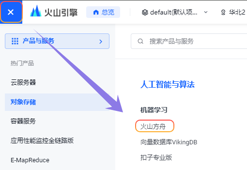
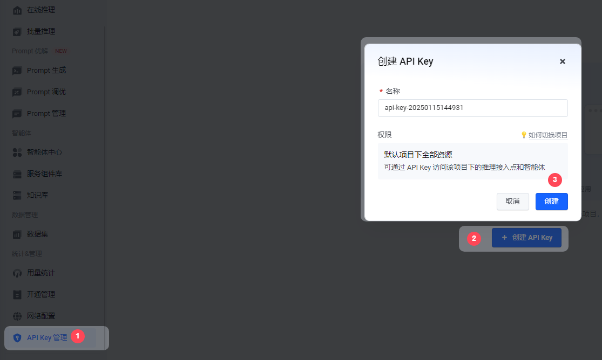
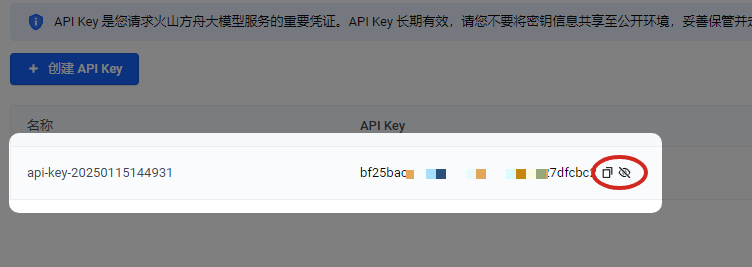
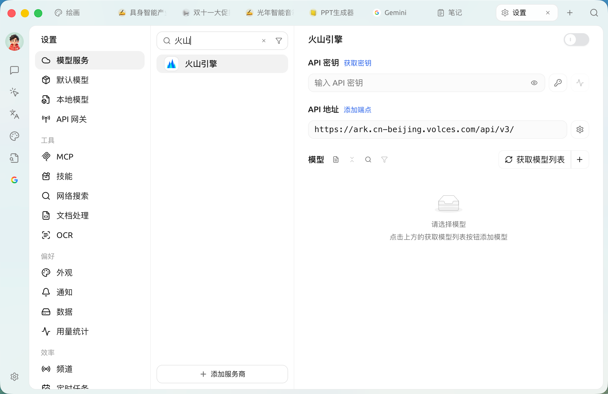
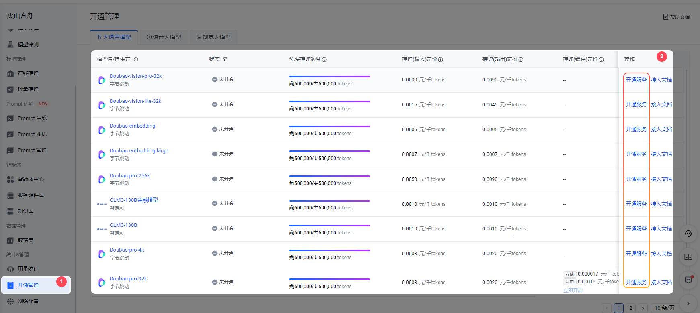
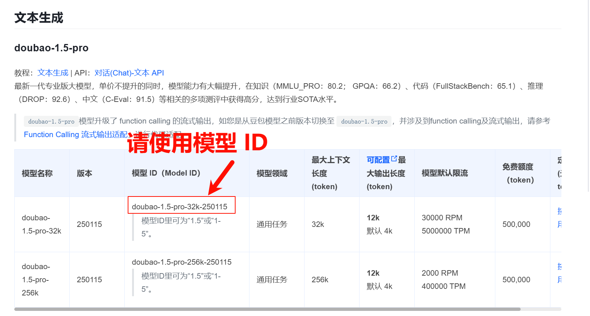
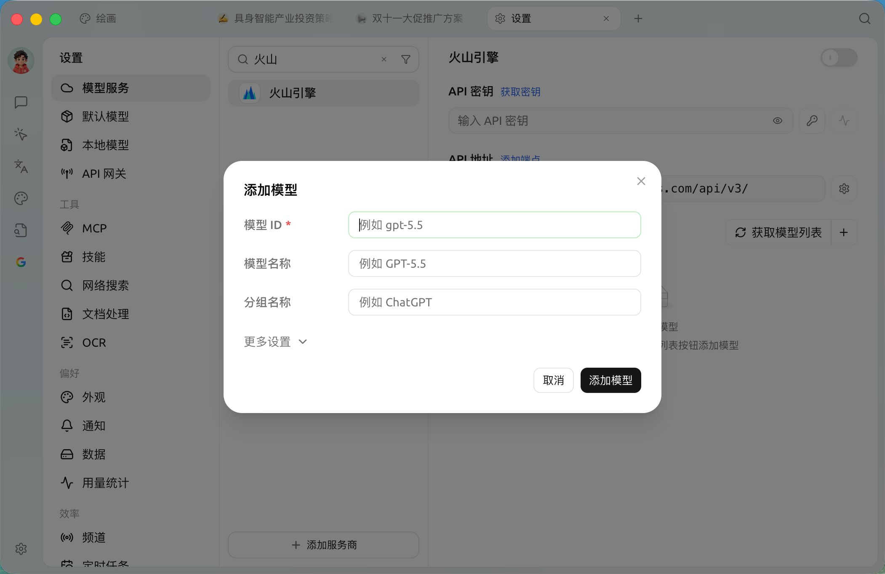
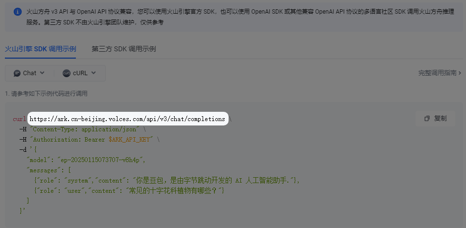

# 火山引擎

* 登录 [火山引擎](https://console.volcengine.com/)
* 直接点击 [这里直达](https://console.volcengine.com/ark/region:ark+cn-beijing/openManagement?LLM=%7B%7D)

<figure><figcaption></figcaption></figure>

### 获取 API Key

* 点击侧栏下方的 [API Key 管理](https://console.volcengine.com/ark/region:ark+cn-beijing/apiKey)
* 创建 API Key

<figure><figcaption></figcaption></figure>

* 创建成功后，点击创建好的 API Key 后的小眼睛打开并复制

<figure><figcaption></figcaption></figure>

* 将复制的 API Key 填入到 CherryStudio 当中后，打开服务商开关。

<figure><figcaption></figcaption></figure>

### 开通并添加模型

* 在方舟控制台侧栏最下方的 [开通管理](https://console.volcengine.com/ark/region:ark+cn-beijing/openManagement?LLM=%7B%7D\&OpenTokenDrawer=false) 开通需要使用的模型，这里可以按需开通豆包系列和 DeepSeek 等模型。

<figure><figcaption></figcaption></figure>

* 在 [模型列表文档](https://www.volcengine.com/docs/82379/1330310#%E6%96%87%E6%9C%AC%E7%94%9F%E6%88%90) 里，找到所需模型对应的 模型 ID。

<figure><figcaption></figcaption></figure>

* 打开 Cherry Studio 的 [模型服务](../settings/providers.md) 设置找到火山引擎
* 点击添加，将之前获得的 模型 ID 复制至 模型 ID 文本对话框即可

<figure><figcaption></figcaption></figure>

* 按照此流程依次添加模型

### API 地址

API 地址有两种写法

* 第一种为客户端默认的：`https://ark.cn-beijing.volces.com/api/v3/`
* 第二种写法为：`https://ark.cn-beijing.volces.com/api/v3/chat/completions#`


两种写法没什么区别，保持默认即可，无需修改。

关于 `/` 和 `#` 结尾的区别参考文档服务商设置的 API 地址部分，[点击前往](../settings/providers.md#api-di-zhi)


<figure><figcaption>
官方文档 cURL 示例
</figcaption></figure>

***

### 获取帮助与提交反馈

如果您在配置或使用过程中遇到任何疑问、Bug 或有功能改进建议，请参考 [反馈与建议](../../question-contact/suggestions.md) 中提供的官方渠道。
