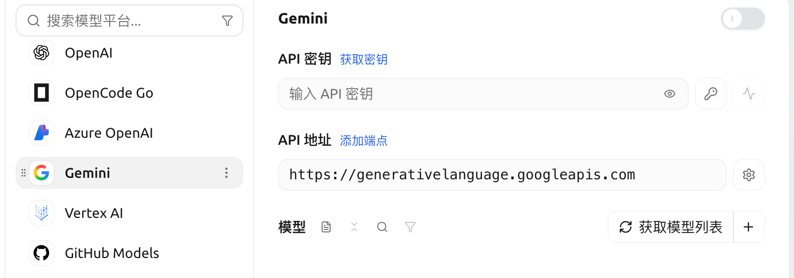

# Google Gemini

## 获取 APIKey

* 获取 Gemini 的 api key 前，你需要有一个 Google Cloud 项目（如果你已有，此过程可跳过）
* 进入 [Google Cloud](https://console.cloud.google.com/projectcreate) 创建项目，填写项目名称并点击创建项目

<figure><figcaption></figcaption></figure>

* 在官方 [API Key 页面](https://aistudio.google.com/app/apikey?hl=zh-cn) 点击 `密钥 创建API密钥`

<figure><figcaption></figcaption></figure>

* 将生成的 key 复制，并打开 CherryStudio 的 [模型服务设置](../settings/providers.md)
* 找到服务商 Gemini，填入刚刚获取到的 key

<figure><figcaption></figcaption></figure>

* 点击最下方管理或者添加，加入支持的模型并打开右上角服务商开关就可以使用了。


- 中国除台湾之外其他地区无法直接使用 Google Gemini 服务，需自行解决代理问题；


***

### 获取帮助与提交反馈

如果您在配置或使用过程中遇到任何疑问、Bug 或有功能改进建议，请参考 [反馈与建议](../../question-contact/suggestions.md) 中提供的官方渠道。
