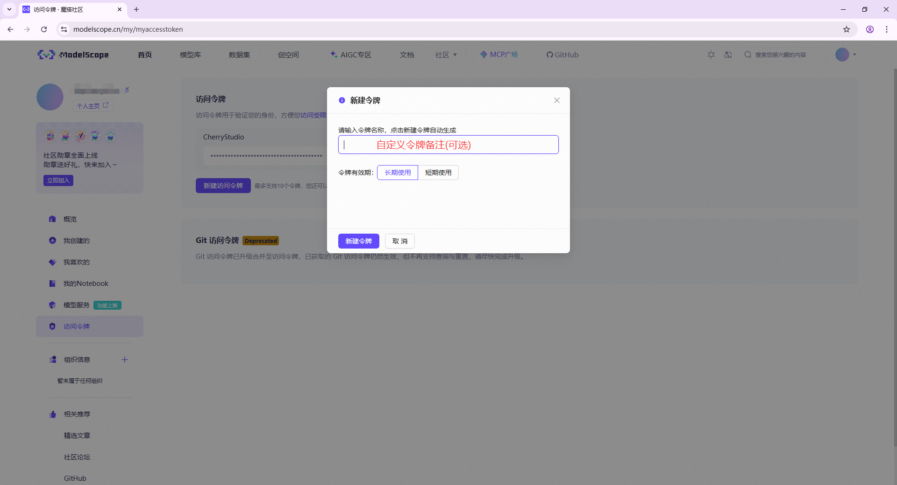
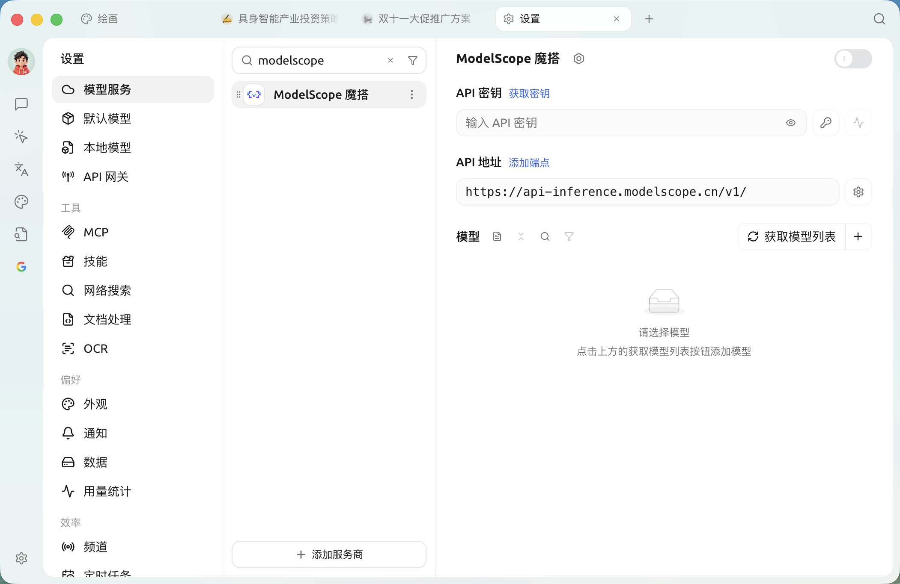
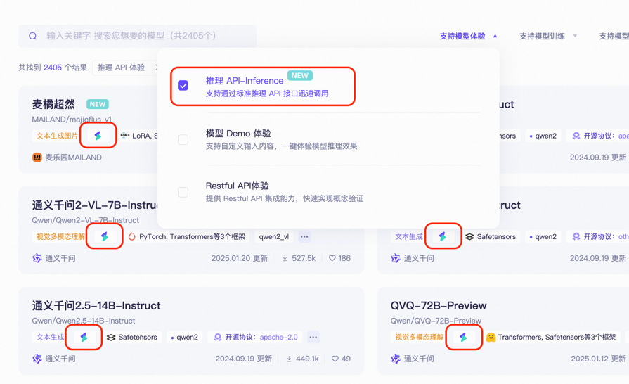
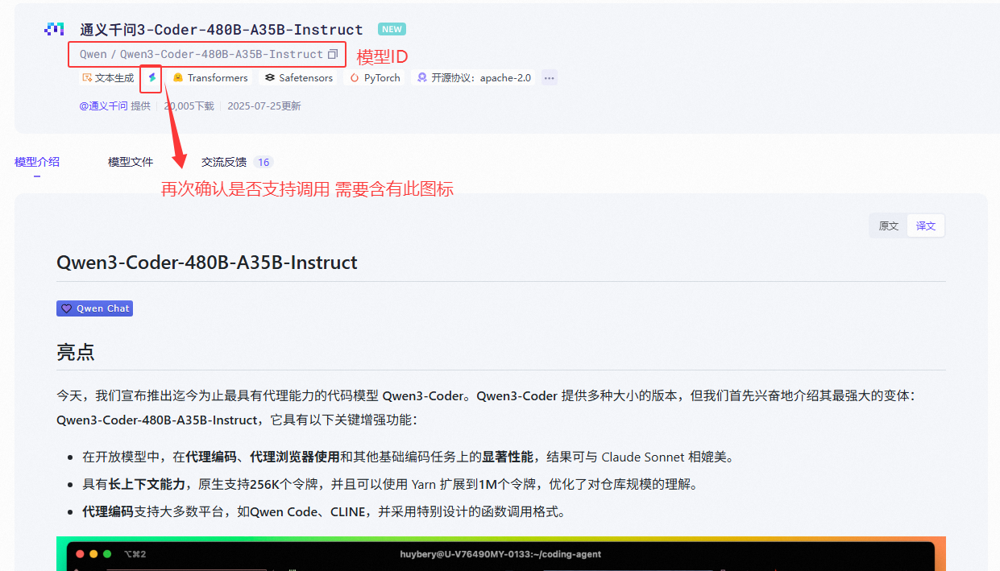
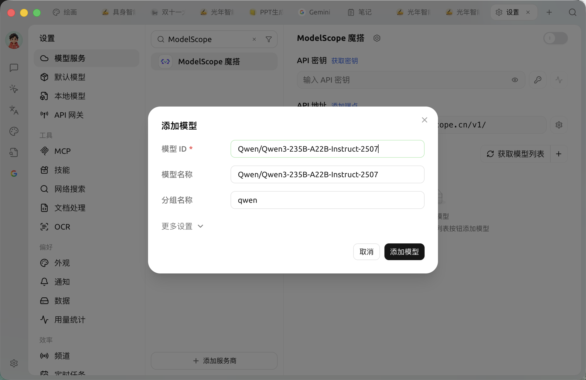
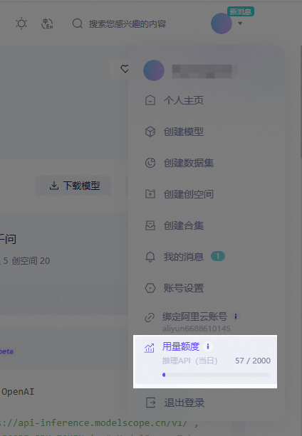

# ModelScope（魔搭）

## 什么是 ModelScope？

> ModelScope 是新一代开源模型即服务（MaaS）共享平台，致力于为泛 AI 开发者提供 **灵活、易用、低成本** 的一站式模型服务解决方案，让模型应用更简单！
>
> 通过 **API-Inference 服务化能力**，平台将开源模型标准化为可调用的 API 接口，开发者可轻量、快速地集成模型能力至各类 AI 应用，支持工具调用、原型开发等创新场景。

### 核心优势

* ✅ **免费额度**：每日提供 **2000 次免费 API 调用额度**（[计费规则](#计费与额度规则)）
* ✅ **丰富模型库**：覆盖 NLP、CV、语音、多模态等 1000+ 开源模型
* ✅ **即开即用**：无需部署，通过 RESTful API 快速调用

***

## Cherry Studio 接入流程

### 步骤 1：获取 ModelScope API 令牌

1. **登录平台**
   * 访问 [ModelScope 官网](https://modelscope.cn) → 点击右上角 **登录** → 选择认证方式 
2. **创建访问令牌**

    * 进入 [**账户设置 → 访问令牌**](https://modelscope.cn/my/myaccesstoken)
    * 点击 **`新建令牌`** → 填写描述 → **复制生成的令牌**（_页面示例见下图_） 

    > 🔑 **重要提示**：令牌泄露将影响账号安全！

### 步骤 2：配置 Cherry Studio

* 打开 **Cherry Studio** → **设置 → 模型服务 → ModelScope**
* 在 `API 密钥` 栏粘贴复制的令牌 
* 点击 **`保存`** 完成授权

### 步骤 3：调用模型 API

1. **查找支持 API 的模型**

    * 访问 [ModelScope 模型库](https://modelscope.cn/models)
    * 筛选条件：**勾选 `API-Inference`**（或认准模型卡片上的 `API` 图标） 

    > API-Inference 覆盖的模型范围，主要根据模型在魔搭社区中的关注程度（参考了点赞，下载等数据）来判断。因此，在能力更强，关注度更高的下一代开源模型发布之后，支持的模型清单也会持续迭代。
2. **获取模型 ID**
   * 进入目标模型详情页 → 复制 **Model ID**（格式如 `damo/nlp_structbert_sentiment-classification_chinese-base`） 
3. **填入 Cherry Studio**
   * 在模型服务配置页的 `模型 ID` 栏输入 ID → 选择任务类型 → 完成配置 

***

## 计费与额度规则

### 重要说明

* 🎫 **免费额度**：每位用户 **每日 2000 次 API 调用**（\*以官网最新规则为准）
* 🔁 **额度重置**：每日 UTC+8 00:00 自动重置，**不支持跨日累计或升级**
* 💡 **超额处理**：
  * 达到当日上限后 API 将返回 `429 错误`
  * 解决方案：切换备用账号 / 使用其他平台 / 优化调用频率

### 查看剩余额度

* 登录 ModelScope → 点击右上角 **`用户名`** → **`API 使用情况`** 

> ⚠️ 注意：推理 API-Inference 每天 2000 次的免费调用额度。更多调用需求可考虑使用阿里云百炼等云上服务。

***

### 获取帮助与提交反馈

如果您在配置或使用过程中遇到任何疑问、Bug 或有功能改进建议，请参考 [反馈与建议](../../question-contact/suggestions.md) 中提供的官方渠道。
