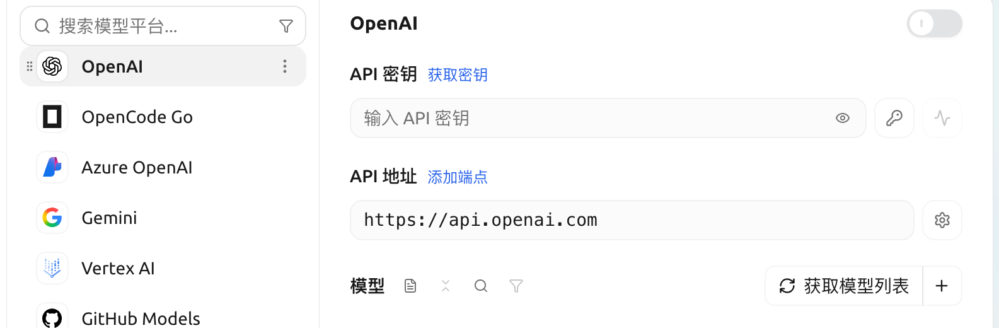

# OpenAI

## 获取 APIKey

* 在官方 [API Key 页面](https://platform.openai.com/api-keys) 点击<mark style="background-color:green;">`+ Create new secret key`</mark>

* 将生成的 key 复制，并打开 CherryStudio 的 [模型服务设置](../settings/providers.md)
* 找到服务商 OpenAI，填入刚刚获取到的 key

<figure><figcaption></figcaption></figure>

* 点击最下方管理或者添加，加入支持的模型并打开右上角服务商开关就可以使用了。


- 中国除台湾之外其他地区无法直接使用 OpenAI 服务，需自行解决代理问题；
- 需要有余额。


***

### 获取帮助与提交反馈

如果您在配置或使用过程中遇到任何疑问、Bug 或有功能改进建议，请参考 [反馈与建议](../../question-contact/suggestions.md) 中提供的官方渠道。
