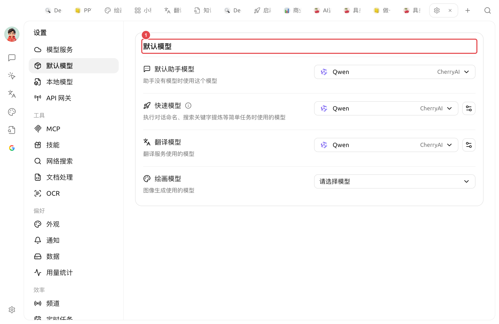

# 默认模型设置

Cherry Studio 在很多场景下都需要"挑一个模型用一下"（比如帮你给对话起名字、优化提示词、做翻译、生成图片），不可能每次都问你"用哪个模型"。**默认模型设置** 就是告诉 Cherry Studio：**当我没明说时，用哪个模型**。

> 注意：这些是"幕后小工"用的模型，**和你聊天用的模型可以不一样**。聊天主模型是在每个助手里单独设的。

<figure><figcaption>
默认模型（① 为区块标题）：下方 默认助手 / 快速 / 翻译 / 绘画 四个默认模型，各自选一个
</figcaption></figure>

## 4 个默认模型分别管什么？

### 默认助手模型

* **谁用**：助手没有指定自己的模型时，自动使用此处的模型
* **怎么选**：选一个你常用、稳定、价格合理的对话模型

### 快速模型

* **谁用**：**对话命名**、**搜索关键字提炼** 等轻量、不需要顶级智能的内部任务
* **怎么选**：用 **便宜快速** 的模型即可，建议选轻量模型、不建议选思考模型

### 翻译模型

* **谁用**：对话框内的消息翻译、翻译页；[划词助手](../../cherrystudio/preview/selection-assistant.md) 中的翻译操作
* **怎么选**：普通对话模型都行；如果中英互译多，DeepSeek 或 Claude 系列效果较好

### 绘画模型

* **谁用**：图像生成（绘画）默认使用的模型
* **怎么选**：选一个你已配置的图像生成模型（如 qwen-image 系列）

## 一句话推荐

如果不想细究，照下面填即可：

| 字段 | 推荐 |
|---|---|
| 默认助手模型 | 你最常用的对话模型 |
| 快速模型 | 便宜快速的轻量模型 |
| 翻译模型 | 任何能遵循指令的对话模型都行（也可选专用翻译模型，如 qwen-mt 系列）|
| 绘画模型 | 你已配置的图像生成模型 |

不确定时全部保持默认，用一段时间发现哪个不够用再回来调整即可。

***

### 获取帮助与提交反馈

如果您在配置或使用过程中遇到任何疑问、Bug 或有功能改进建议，请参考 [反馈与建议](../../question-contact/suggestions.md) 中提供的官方渠道。
