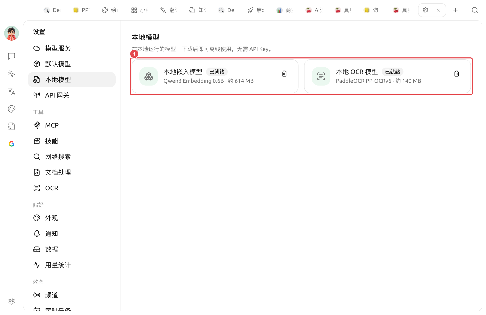

# 本地模型

本地模型是 Cherry Studio 内置、**下载后即可离线运行** 的小模型：不走任何服务商 API，也不需要填 API Key。它们体积小、跑在你自己的电脑上，专门用来兜底一些"不值得为它单独配一个云端模型"的基础能力。

打开 `设置 → 本地模型` 即可管理：

<figure><figcaption>
本地模型：① 两个内置本地模型——本地嵌入模型 + 本地 OCR 模型（图中均为「已就绪」，可点右侧删除移除）
</figcaption></figure>

目前内置两类本地模型：

| 本地模型 | 底层 | 大小 | 用途 |
| ------------- | -------------------- | -------- | --------------------------------------------------------------- |
| **本地嵌入模型** | Qwen3 Embedding 0.6B | 约 614 MB | 把文本转成向量，用于 [知识库](../../knowledge-base/knowledge-base.md) 检索、召回等场景 |
| **本地 OCR 模型** | PaddleOCR PP-OCRv6 | 约 140 MB | 离线识别图片 / 扫描件里的文字，供 [OCR](ocr.md) 功能调用 |

### 下载与状态

* 模型名称旁会显示状态徽章：未下载的卡片 **底部** 有一条整宽「**下载**」按钮，点击开始下载；下载完成后徽章变为 **已就绪**。
* 已就绪的模型可点击右侧的 **删除** 图标移除，释放磁盘空间；需要时可再次下载。（若嵌入模型仍被知识库使用，删除会被拒绝、权重保留。）
* 少数平台 / 架构不支持本地推理时，面板会显示「**当前平台不支持本地模型**」，此时不提供下载。

下载时如果一个镜像不可用，Cherry Studio 会自动尝试其他下载源。下载完成后，本地嵌入模型的推理过程在本机运行，不需要联网。


如果页面提示【模型文件不完整，请重新下载修复。】，说明本地缓存缺少必要文件。删除或重新下载该模型即可修复；不要手动拼接模型文件。



本地模型是 **可选项**。如果你已经在 [模型服务](providers.md) 里配置了云端嵌入模型，或用系统自带 OCR 就够用，可以不下载它们。


### 什么时候用本地模型

* **没有云端嵌入模型 / 不想为知识库单独付费**：下载本地嵌入模型，知识库就能在完全离线的情况下建索引与检索。
* **需要离线 OCR**：在没有网络、或不希望图片上传到第三方的场景，下载本地 OCR 模型，配合 [OCR 设置](ocr.md) 选择「本地 PaddleOCR」即可。
* **隐私优先**：所有计算都在本机完成，内容不会离开你的电脑。


本地模型是"够用就好"的轻量方案。若对检索精度或识别准确率要求很高，云端的 [嵌入模型](../../knowledge-base/emb-models-info.md)、更强的 OCR 服务通常效果更好。


***

### 获取帮助与提交反馈

如果您在配置或使用过程中遇到任何疑问、Bug 或有功能改进建议，请参考 [反馈与建议](../../question-contact/suggestions.md) 中提供的官方渠道。
