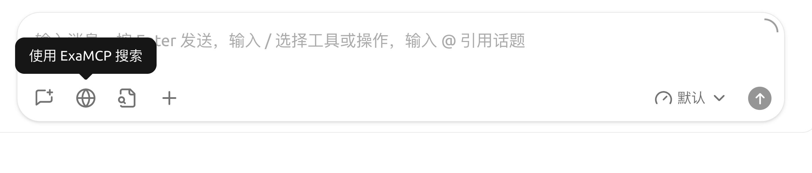
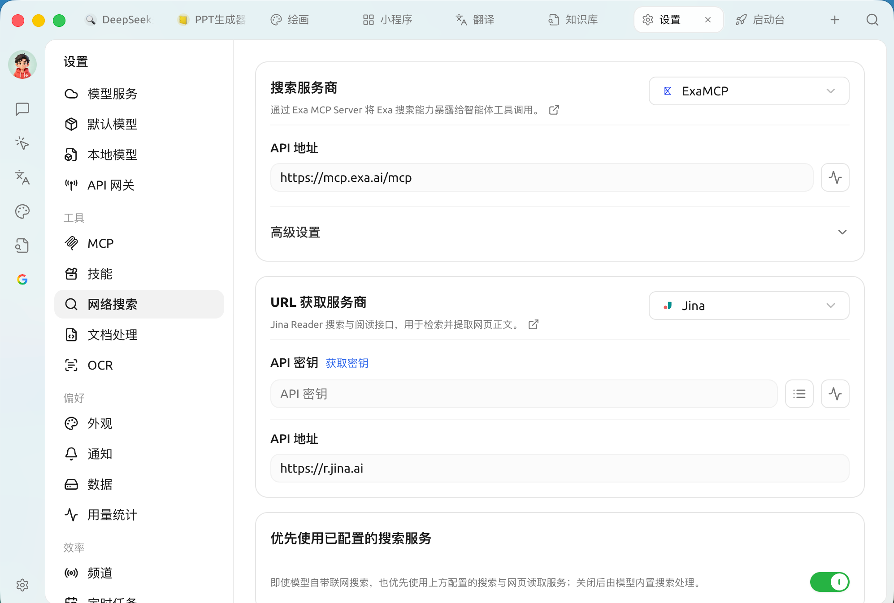
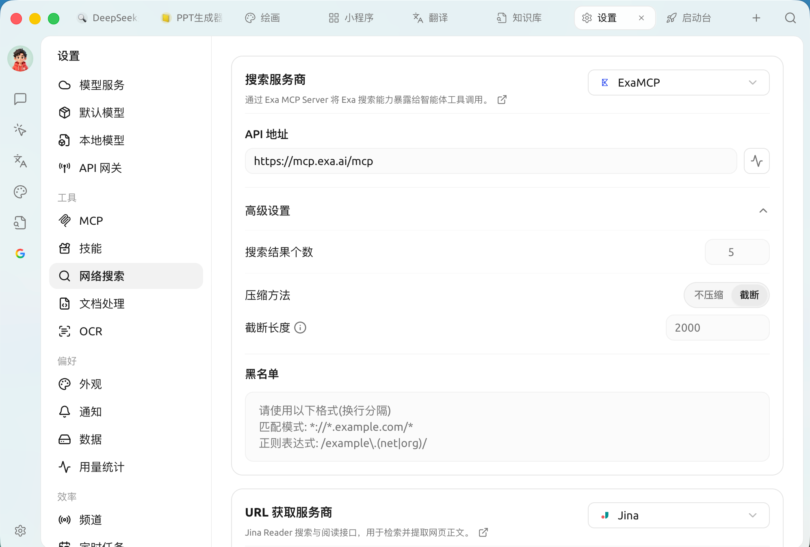

# 联网模式


联网模式让 AI 在回答前先去搜索最新内容，适合以下场景：

* **时效性信息**：今日 / 本周 / 刚刚发生的新闻、价格、汇率等
* **实时数据**：天气、股价、商品库存等动态数值
* **新兴知识**：刚出现的工具、概念、技术


## 如何开启联网

在对话输入框的工具栏中点击 🌐 **小地球** 图标，即可对当前对话开启联网。

<figure><figcaption>
对话输入栏的地球图标：点击即对当前对话开启联网（提示会显示当前搜索服务商）
</figcaption></figure>

**开箱即用**：Cherry Studio 默认已内置 **Exa MCP** 作为搜索服务商，**无需配置任何 API 密钥**（走公开的 MCP 端点 `mcp.exa.ai`），默认的 URL 获取服务商是 **Jina**。所以装好后点 🌐 就能直接联网搜索。

## 走配置的服务，还是模型内置联网

联网走哪条路，由 `设置 → 网络搜索` 底部的「**优先使用模型内置的联网工具**」开关决定，它 **默认关闭**：

* **关闭（默认）**：点 🌐 会走你在 `设置 → 网络搜索` 里配置的服务——初始就是免密钥的 Exa MCP。
* **开启**：如果模型自身 **原生带搜索**（模型名旁有小地球图标 🌐），则交由模型自己的联网处理。

是否支持原生联网，请以模型名称旁的 🌐 图标为准，不要依赖固定模型清单。当前常见情况包括：

* **DeepSeek**：支持该能力的模型可使用原生网络搜索；
* **OpenRouter**：对话模型可使用原生网络搜索和 URL 内容读取；
* **阿里云百炼**：支持该能力的模型可使用原生网络搜索，部分 Qwen 模型还支持 URL 内容读取；
* Google Gemini、智谱 AI、xAI Grok 等服务商的部分模型也支持原生联网。

模型能力会随服务商调整。选择模型时认准 🌐 图标；没有图标时，使用已配置的搜索服务更稳妥。


还有少数模型即使没显示小地球图标，也能联网（取决于服务商配置）。例如 [火山引擎接入联网](volcengine.md) 中介绍的一类情况。


## 在设置里配置服务

打开 `设置 → 网络搜索`，配置分成两个部分，每个部分用一个下拉框选择服务商，**选中的即作为该能力的默认**：

| 分区 | 作用 |
| ------------- | --------------------- |
| **搜索服务商** | 根据你的问题检索网页，返回结果摘要 |
| **URL 获取服务商** | 从指定网址抓取网页正文，补全搜索结果的内容 |

<figure><figcaption>
网络搜索设置：搜索服务商 / URL 获取服务商 两个分区，与底部「优先使用模型内置的联网工具」开关
</figcaption></figure>

### 内置服务商

内置以下服务，类型分 **API** 与 **MCP** 两种：

| 服务 | 类型 | 能力 | 说明 |
| ------------- | --- | ----------- | ------------------------------- |
| **Exa MCP** | MCP | 搜索 | **默认**，免密钥即用 |
| **Tavily** | API | 搜索 | 专为 LLM 优化的搜索引擎 |
| **Bocha（博查）** | API | 搜索 | 面向 AI 场景的中文搜索 API，实时网页 + 结构化结果 |
| **Exa** | API | 搜索 | 为 AI 应用设计的神经搜索，擅长语义检索 |
| **Zhipu（智谱）** | API | 搜索 | 智谱 GLM Web Search，联网搜索与实时信息 |
| **Querit** | API | 搜索 | 面向 AI 应用的网页检索服务 |
| **SearXNG** | API | 搜索 | 可自托管的免费元搜索引擎 |
| **Firecrawl** | API | 搜索 | 网页抓取与搜索，可将结果转 Markdown |
| **Jina** | API | 搜索 · URL 获取 | Jina Reader；也是 **默认的 URL 获取服务商** |
| **Fetch** | API | URL 获取 | 内置 URL 获取，从指定网址抓正文 |

> 除默认的 **Exa MCP**（免密钥）外，多数 API 服务商需填各自的 API 密钥；**SearXNG** 填自部署地址，**Fetch** 为内置、无需配置。

### 高级设置

* **搜索结果个数**：单次返回多少条（默认 5，最多 100）。未开启压缩时数量过大会消耗更多 Token。
* **搜索结果压缩**：把返回内容压缩后再喂给模型，节省 Token。默认即为「截断」，截断长度默认 2000 字符；也可改为「不压缩」，或调整截断长度。
* **搜索结果黑名单**：屏蔽不想出现的网站，详见 [网络搜索黑名单配置](blacklist.md)。

<figure><figcaption>
高级设置：搜索结果个数、压缩方法（不压缩 / 截断）、黑名单
</figcaption></figure>

## 相关配置

默认的 Exa MCP 免密钥即可用；想换用其他服务或深入配置，见下面几篇：

* [免费联网模式](free-search.md) —— 不花钱也能用上搜索能力
* [Tavily 联网登录注册教程](tavily.md) —— 换用 Tavily 时，如何注册并获取密钥
* [SearXNG 本地部署与配置](searxng.md) —— 自托管、完全本地化
* [网络搜索黑名单配置](blacklist.md) —— 屏蔽不想要的网站

## 工作机制

无论走哪种方式，对话流程都是：

1. 你问“今天上海天气怎么样？”
2. Cherry Studio 把问题先发给搜索服务
3. 搜索服务返回相关网页摘要
4. Cherry Studio 把这些摘要拼到提示词里发给 AI 模型
5. AI 基于实时数据回答你

***

### 获取帮助与提交反馈

如果您在配置或使用过程中遇到任何疑问、Bug 或有功能改进建议，请参考 [反馈与建议](../../question-contact/suggestions.md) 中提供的官方渠道。
