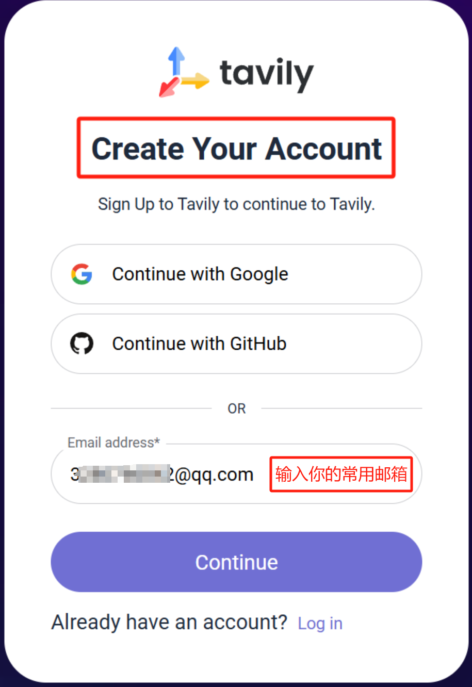
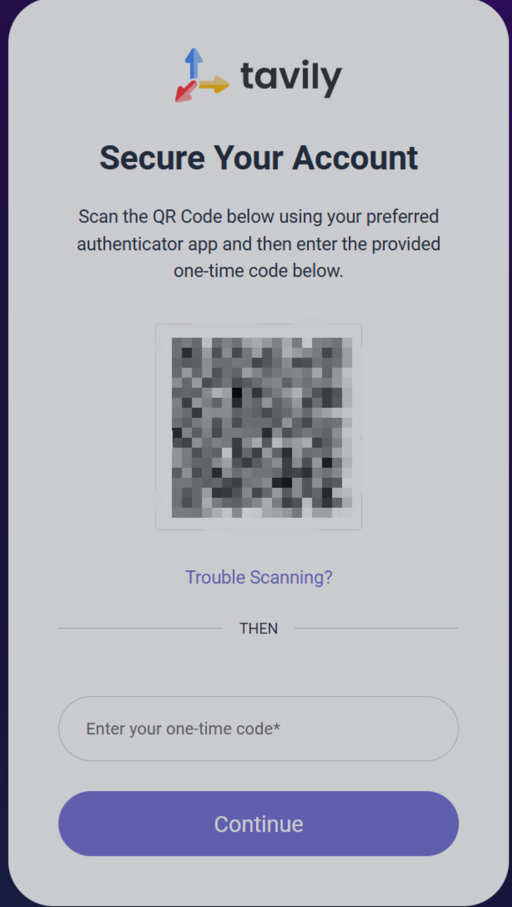
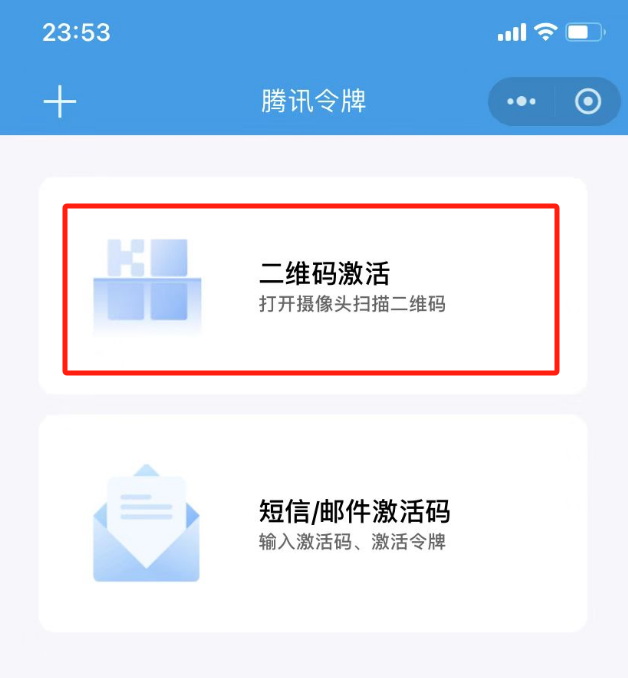
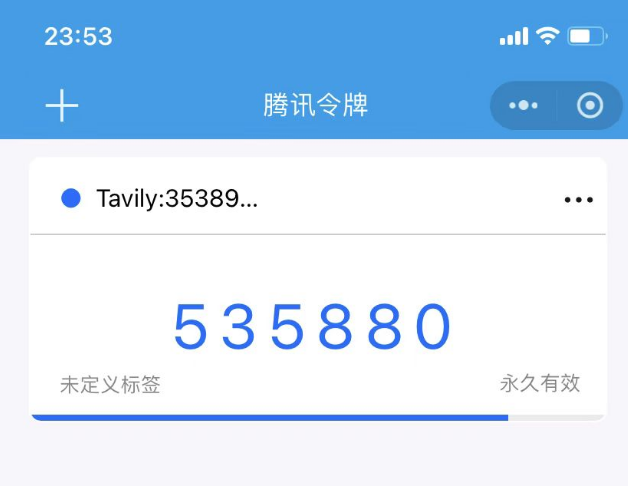
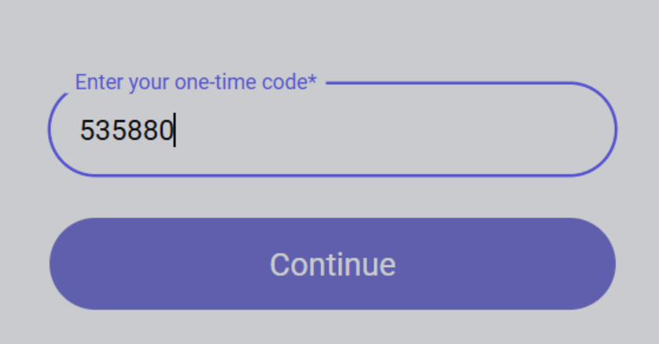
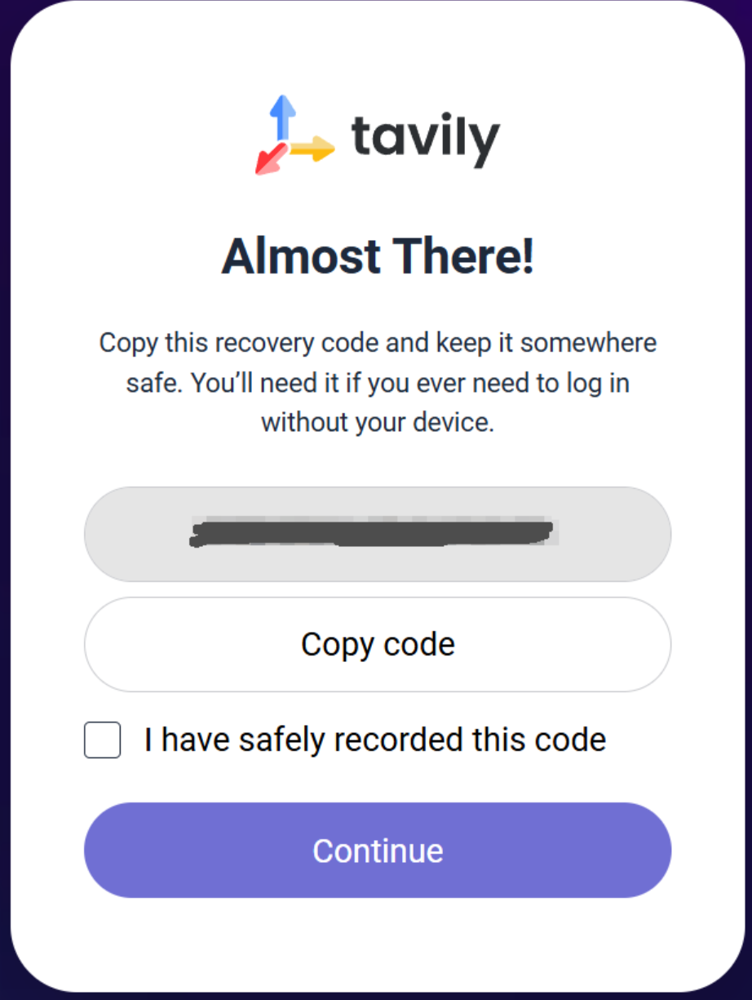
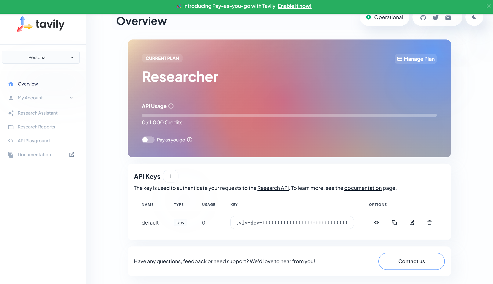

# Tavily 联网登录注册教程

### 一、tavily 官网

[https://app.tavily.com/home](https://app.tavily.com/home)


有的同学访问可能比较慢，如果有代理，可以使用代理。


### 二、tavily 注册详细步骤

访问上述官网，或者从 cherry studio - 设置 - 网络搜索 - 点击「获取密钥」，会直接跳转到 tavily 登录注册页面。


如果是第一次使用，要先注册一个（Sign up）账号，才能登录（Log in）使用。默认跳转的是登录页面哦。


1. 点击注册账号，进入下面的界面，输入自己的常用邮箱，或者使用谷歌、github 账号，然后下一步输入密码，常规操作。

<figure><figcaption>
注册账号
</figcaption></figure>

2. 🚨🚨🚨<mark style="color:red;">**【**</mark><mark style="color:green;background-color:red;">**关键步骤**</mark><mark style="color:red;">**】 注册成功后，会有一个**</mark><mark style="color:green;">**动态验证码**</mark><mark style="color:red;">**的步骤，需要扫描二维码，生成一次性 Code 才能继续使用。**</mark>

<figure><figcaption>
很多同学卡在这一步，人麻了....莫慌
</figcaption></figure>


很简单，此时你有 2 个办法。

1. 下载一个验证身份的 APP，微软出的—— Authenticator 【略微繁琐】
2. 使用微信小程序：腾讯身份验证器 。【简单，有手就行，建议】


3. 打开微信小程序，搜索：腾讯身份验证器

<figure><figcaption>
微信小程序-搜索-点击打开
</figcaption></figure>

<figure><figcaption>
点击后，扫描刚才 tavily 页面的二维码
</figcaption></figure>

<figure><figcaption>
你会得到一串数字
</figcaption></figure>

<figure><figcaption>
复制到 tavily 页面
</figcaption></figure>

<figure><figcaption>
会提示你复制 code 到安全的地方，听劝照做，虽然不咋会用上
</figcaption></figure>

### 三、注册成功

上面的步骤做完，就会进入下面的界面，说明你注册成功了，复制 key 到 cherry studio 就可以开始愉快的使用了。

<figure><figcaption></figcaption></figure>

***

### 获取帮助与提交反馈

如果您在配置或使用过程中遇到任何疑问、Bug 或有功能改进建议，请参考 [反馈与建议](../../question-contact/suggestions.md) 中提供的官方渠道。
