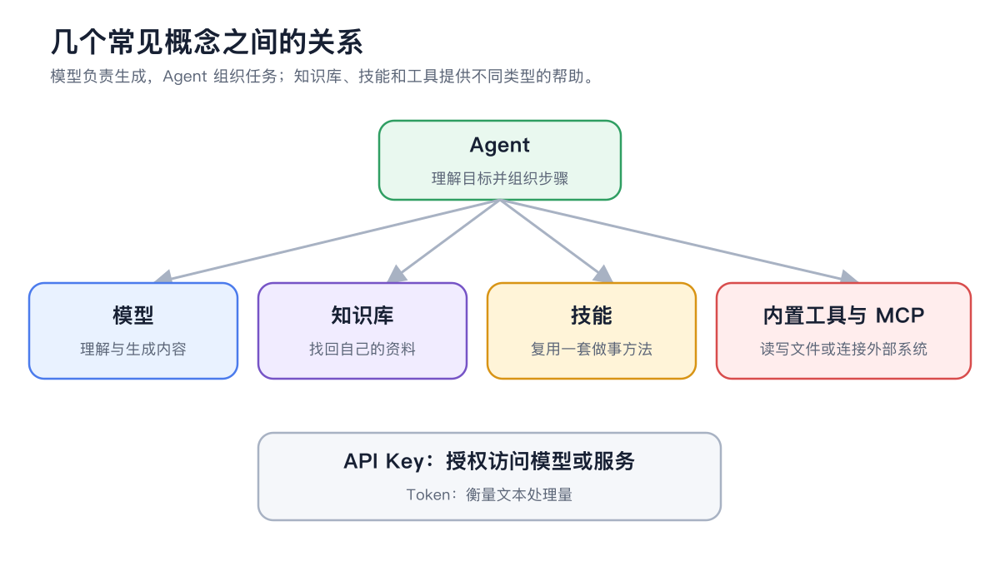

# AI 基础知识

这页解释 Cherry Studio 中最常见的术语，帮助你判断应该改模型、改提示词，还是增加工具。

<figure><figcaption>
Agent 组织任务，模型生成内容；知识库、技能和工具分别提供资料、方法和操作能力。
</figcaption></figure>

## 模型服务、模型与 API Key

* 模型服务：提供模型调用的厂商、云平台或本地运行环境；
* 模型：完成文本、视觉、绘画、嵌入或重排序等具体任务的能力；
* API 地址：Cherry Studio 发送请求的服务入口；
* API Key：服务商识别账号和授权调用的凭据。

同一个服务商可以提供多种模型。API Key 能连接服务，不代表每个模型都已开通，也不代表接口类型一定兼容。

## Token 与上下文窗口

Token 是模型处理文本时使用的基本单位，并不等同于汉字或单词。输入、历史消息、工具定义、知识库内容和输出都会占用上下文。

上下文窗口是一次请求能处理的总量。接近上限时，Cherry Studio 可能压缩较早内容；重要事实应放进明确的提示词、文件、知识库或 Agent 记忆，不要只依赖很久以前的一句话。

## 采样参数

| 参数 | 作用 | 调整方向 |
| ----------- | -------- | ----------------------- |
| Temperature | 控制输出随机性 | 事实任务偏低，创意任务可适当提高 |
| Top P | 限制候选词范围 | 通常与 Temperature 只重点调整一个 |
| Max Tokens | 限制单次输出长度 | 过低会截断，过高不代表内容更好 |

不同模型对参数的支持与含义可能略有差异。没有明确问题时先使用产品默认值，不套用网上的“万能参数”。

## Embedding 与 Rerank

* 嵌入模型：把文本转换成向量，用于知识库相似度检索；
* 重排序模型：对初步检索结果重新排序，提高最相关内容的位置。

它们不负责生成最终回答。知识库没有结果时，先检查文档处理和嵌入；结果有但排序不理想，再考虑重排序。

## 助手与 Agent

* 助手：以持续对话、固定角色和输出风格为中心；
* Agent：以目标执行、工作目录、工具和多步骤任务为中心。

简单问答用助手更直接；需要文件、终端、子任务、频道或定时任务时使用 Agent。

## 技能、工具、MCP 与知识库

| 概念 | 一句话理解 |
| --- | ----------------------- |
| 工具 | Agent 可以执行的一个动作 |
| 技能 | 告诉 Agent 怎样按固定方法工作 |
| MCP | 把外部工具和资源接入 Agent |
| 知识库 | 给 Agent 或助手限定可检索的资料 |
| 记忆 | 为同一 Agent 保存跨任务的稳定事实和经验 |

## 多模态与绘画模型

多模态模型可以理解图片、文本等不同输入；绘画模型专门生成图片。Agent 的主模型负责理解你的要求，内置【生成图片】工具则调用【设置】→【默认模型】中选择的绘画模型。


能看图、能生成图、能调用工具是三种不同能力。选择模型时先确认任务需要什么，不要只看模型名称。


本地模型一定更隐私吗？

模型在本地运行可以减少把内容发送给模型服务商，但联网搜索、MCP、频道和其他外部工具仍可能传输数据。隐私取决于整条工作流，不只取决于模型位置。

